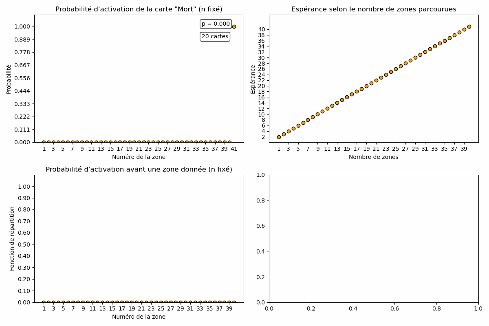

## Un peu de probabilités en lien avec le jeu vidéo Hades II.

La probabilité que la carte "Mort" soit obtenue lors de la zone numéro $k$ est :

$$ \text{ si } k \leq n, P(X=k) = \frac{p}{\text{c}} \sum_{j=0}^{\min(c-1, k-1)} \binom{k-1}{j} p^j (1-p)^{k-1-j}$$

Si la carte n'est pas obtenue au bout des $n$ zones, on a alors

$$P(X=n+1) = \frac{p}{\text{c}} \sum_{j=0}^{\min(c-1, n)} \binom{n}{j} p^j (1-p)^{n-j} (c-j)$$

L'espérance, pour $n$ fixé, est 

$$E(X)=\sum_{k=1}^{n+1}kP(X=k)$$

