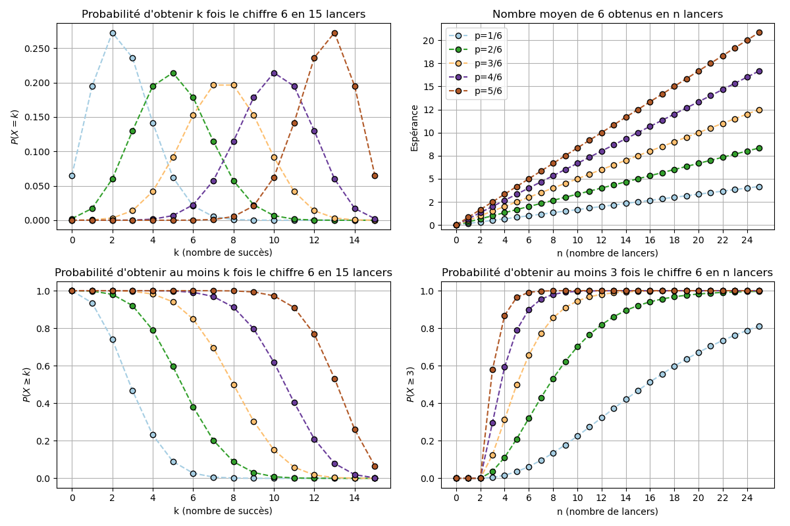
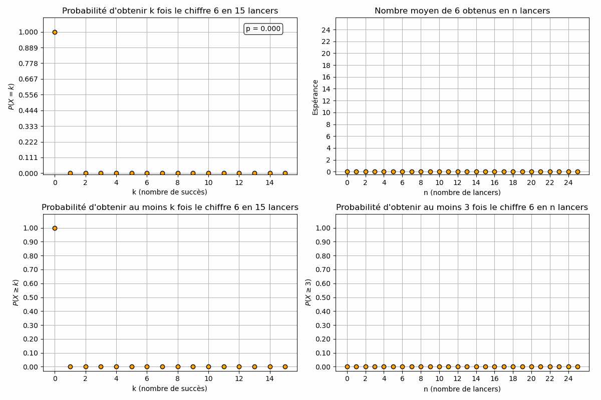
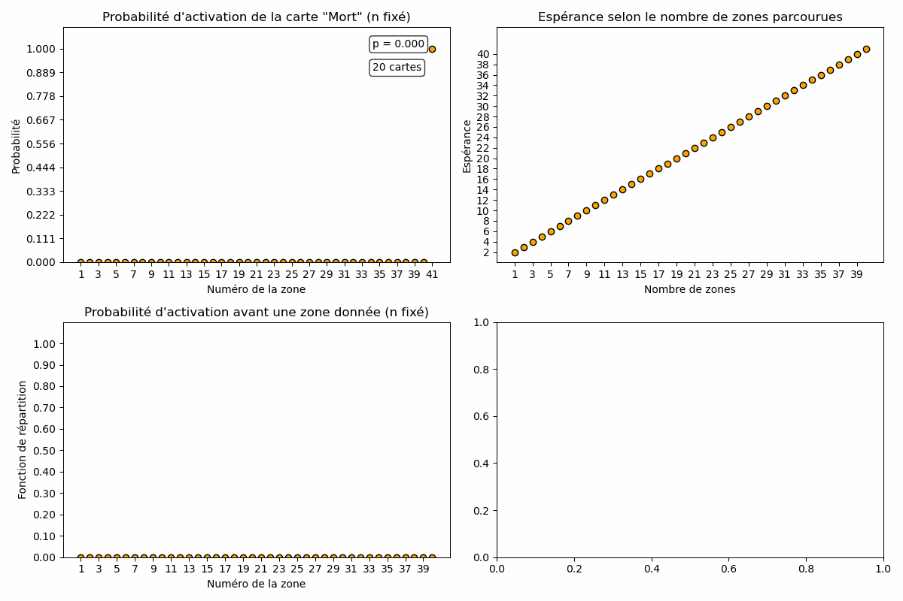
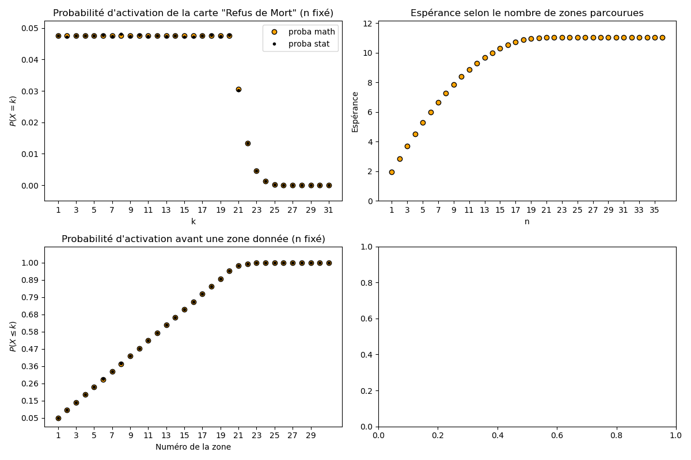

## Un peu de probabilités

On lance un certain nombre de fois un dé à 6 faces, et on compte le nombre de fois où on a obtenu le chiffre 6. On suppose qu'à chaque lancer, la probabilité d'obtenir un 6 est $p$, avec bien sûr $p=\frac16$ si le dé n'est pas truqué. Voici quelques résultats intéressants :

## Un peu de probabilités en lien avec le jeu vidéo Hades II.

Avec les règles fictives définies lors du dernier devoir, la probabilité que la carte "Refus de Mort" soit obtenue lors de la zone numéro $k$ est :

$$ \text{ si } k \leq n, P(X=k) = \frac{p}{\text{c}} \sum_{j=0}^{\min(c-1, k-1)} \binom{k-1}{j} p^j (1-p)^{k-1-j}$$

Si la carte n'est pas obtenue au bout des $n$ zones, on a alors

$$P(X=n+1) = \frac{p}{\text{c}} \sum_{j=0}^{\min(c-1, n)} \binom{n}{j} p^j (1-p)^{n-j} (c-j)$$

On peut remarquer que tant que le nombre de zones franchies est inférieur au nombre de cartes, la loi est uniforme. En effet, si $k\leq c$, alors l'expression de $P$ devient 
$P(X=k) = \frac{p}{\text{c}} \sum_{j=0}^{k-1} \binom{k-1}{j} p^j (1-p)^{k-1-j}$, qui devient simplement, en reconnaissant un binôme de newton, $P(X=k)=\frac{p}{\text{c}}(p+(1-p))^{k-1}=\frac{p}{\text{c}}$.

L'espérance, pour $n$ fixé, est 

$$E(X)=\sum_{k=1}^{n+1}kP(X=k)$$

Les résultats précédents sont issus de calculs purement mathématiques. En faisant une simulation purement numérique, où on répète 1 million de fois l'expérience, on retrouve bien statistiquement nos résultats théoriques :

